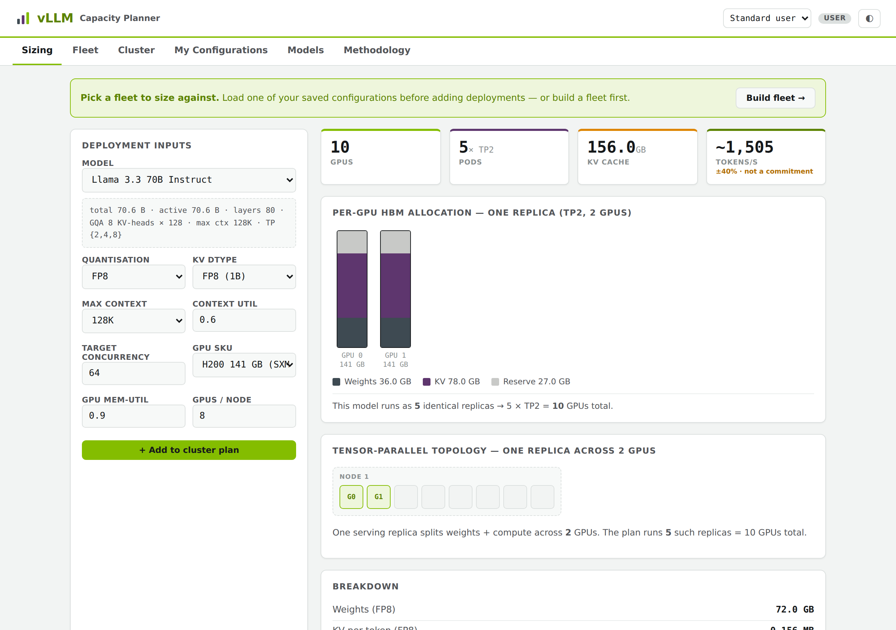

# vLLM Capacity Planner

A self-hostable web tool for **sizing LLM inference deployments on GPUs** — how many GPUs, which tensor-parallel topology, how much KV-cache budget, how many concurrent sessions, expected throughput, and cost. It turns "serve model X at context Y for Z concurrent users" into a defensible, reproducible GPU/pod/node answer in seconds.

The sizing math is a deterministic memory-bandwidth model (the same roofline vLLM-style serving is bound by). See the in-app **Methodology** tab or [`docs/METHODOLOGY.md`](docs/METHODOLOGY.md).

**▶ [Live demo](https://llm-sizing.vercel.app/)** — runs in your browser, no sign-up. Sizing, fleet, cluster, cost and methodology all work client-side; catalog editing / saved configs / Hugging Face import need the API (run the server).



## Features

- **Deployment sizing** — pick a model, quantisation, KV dtype, context, concurrency and GPU SKU → TP size, weights/KV memory, concurrency-per-pod, pods, GPUs, nodes, TTFT, and throughput. Every plan gets a **fits / tight / infeasible** verdict: "tight" means under 10% pod headroom once weights and one request's KV are placed — feasible on paper, likely to OOM on launch.
- **Quantisation-aware weight model** — the 16-bit embedding and `lm_head` that survive quantisation are sized explicitly from `vocab_size × hidden_size`, and low-bit formats are charged their *effective* bytes/param including per-group scale metadata (INT4 ≈ 0.52, MXFP4 ≈ 0.53, NVFP4 ≈ 0.5625). A flat overhead factor under-sizes an INT4 70B by >10%.
- **GGUF k-quants** — Q4_K_M (0.61 B/param, 4.9 real bits — not 4.0), Q8_0 and IQ4_XS, treated as whole-file averages that already include the embedding layers. Pinned against published checkpoints: Llama-3.3-70B Q4_K_M → 43.1 GB.
- **Three attention regimes** — full-context, sliding-window (GPT-OSS, Gemma, Mistral v0.1), and linear/recurrent (Kimi K3's KDA, Qwen3-Next), the last holding a *constant* state that never grows with context. GPT-OSS-120B at 128K halves, 5.4 → 2.7 GiB; Qwen3.6-27B at 256K drops 3.9×, 19.2 → 4.9 GiB; Kimi K3 at 1M drops 3.7×, 31.4 → 8.5 GiB. Catalog geometry is taken from each model's published `config.json`.
- **One memory unit throughout** — every figure is **GiB (2³⁰ bytes)**, matching `nvidia-smi` and what `gpu_memory_utilization` is applied against; bandwidth stays decimal TB/s as vendors quote it, and the roofline converts to raw bytes rather than mixing scales.
- **GPU catalog** — NVIDIA datacenter (L4 → B300), AMD Instinct (MI300X/MI325X/MI355X), and workstation/consumer (RTX PRO 6000 Blackwell, 5090, 4090) SKUs, all admin-editable.
- **Visuals** — per-GPU HBM allocation (weights / KV / reserve), tensor-parallel topology across GPUs & nodes, infeasibility & multi-node signals.
- **Concurrency rubric** — sweep target concurrency and read off GPUs, per-request and aggregate tokens/sec.
- **Fleet + Cluster** — define a mixed-SKU GPU fleet, add sized models, see **utilisation vs free space** per SKU, and get hard-blocked from over-committing the hardware.
- **Launch command** — every plan emits a runnable `vllm serve` (or `docker run`) command built from its own numbers: TP size, `--max-model-len`, `--gpu-memory-utilization`, `--kv-cache-dtype`, and `--max-num-seqs` capped at the pod's actual KV budget. Notes call out multi-node replicas, tight headroom, and that the command is one replica of N.
- **Import from Hugging Face + vLLM recipes** — `config.json` supplies the geometry (layers, heads, embedding sizes, attention regime); [recipes.vllm.ai](https://recipes.vllm.ai) supplies the four fields it never carries (parameter counts, context length, shipped quantisations, TP sizes). Together they import a model with no hand-typing, and the recipe's stated VRAM floor is shown beside our own estimate as a cross-check.
- **Saved configurations** — save a fleet + plan as a named, reloadable scenario.
- **Model catalog** — a browsable model-card catalog with admin CRUD, plus **import model geometry from Hugging Face** (fetches `config.json`, maps it to the model schema for review + commit).
- **Cost estimation** — set a $/GPU-hour per SKU and get cluster run-rate ($/hr·mo·yr), per-SKU line items, and **cost per million tokens**; export the estimate as CSV or JSON.
- **Light / dark**, keyboard-friendly, single-file-store persistence.

## Quick start (local)

Requires **Node.js 20+**.

```bash
git clone https://github.com/YOUR_USER/vllm-capacity-planner.git
cd vllm-capacity-planner
npm install
npm run build -w web          # build the SPA
npm start -w server           # serve API + SPA on http://localhost:8080
```

Or for web hot-reload during development, run the API and the Vite dev server in two terminals:

```bash
npm start -w server           # API on :8080
npm run dev -w web            # SPA on :5173, proxying /api to :8080
```

Data (the catalog + saved configs) persists to `server/data/catalog.json` by default (override with `DATA_FILE`).

## Testing

```bash
npm test            # domain acceptance vectors + server integration tests
```

The **sizing acceptance vectors** (`domain/src/__tests__/acceptance.test.ts`) pin the engine's outputs for known model/GPU combinations and run in CI.

## Architecture

A small TypeScript monorepo with a **shared, isomorphic domain core** — the sizing engine and validation schemas live once and run in the browser (live, <100 ms), on the server (authoritative), and in CI.

| Package | What |
|---|---|
| `domain/` | Pure TS: sizing engine, Zod validation, seed catalog, Hugging Face mapping, reconciliation. No I/O. |
| `web/`    | Svelte 5 + Vite SPA. Runs the engine client-side for instant feedback. |
| `server/` | Fastify API: catalog CRUD, sizing, reconciliation, saved configs, HF import; serves the built SPA. |
| `migrations/` | PostgreSQL schema (optional prod store — see below). |
| `deploy/` | Dockerfile + a generic Kubernetes example. |

**Persistence:** ships with a zero-dependency JSON file store (great for single-instance / local use). For horizontal scaling, swap in PostgreSQL behind the same `Store` interface (`migrations/001_init.sql` is the schema).

**Access model:** the app has an Admin / Standard-user role toggle enforced server-side. For a self-hosted single-tenant instance this is fine as-is; **for multi-user deployments, put it behind your own auth/SSO proxy** — the role is currently taken from a request header (see `server/src/app.ts`), a deliberate shim, not production authentication.

## Deploy

Build the image and run it anywhere:

```bash
docker build -t vllm-capacity-planner -f deploy/Dockerfile .
docker run -p 8080:8080 -v $PWD/data:/data vllm-capacity-planner
```

For Kubernetes, `deploy/k8s.yaml` is a generic example (set your image + Ingress host).

### Static demo (Vercel / Netlify / GitHub Pages)

The sizing engine runs entirely client-side and falls back to the built-in seed catalog when no API is reachable, so you can host just the built SPA (`web/dist`) on any static host for a working **sizing + methodology** demo. Catalog editing, saved configurations, Hugging Face import, and cost persistence require the API (run the server).

This repo includes a **`vercel.json`** for a one-click static deploy on Vercel (it runs `npm run build -w web` and serves `web/dist`) — that's what powers the [live demo](https://llm-sizing.vercel.app/). For any other static host:

```bash
npm run build -w web      # outputs web/dist — deploy this folder statically
```

## Contributing

Contributions welcome — see [CONTRIBUTING.md](CONTRIBUTING.md). The sizing engine is a pure, tested module; every math change ships with an acceptance vector.

## Accuracy & caveats

Outputs are **first-order roofline estimates** — throughput ±40%, TTFT ±50%. They're planning figures, not commitments; validate against real benchmarks before procurement. The seeded model geometry and GPU bandwidths/prices are indicative — verify against authoritative sources for your models and hardware.

## License

MIT — see [LICENSE](LICENSE).
